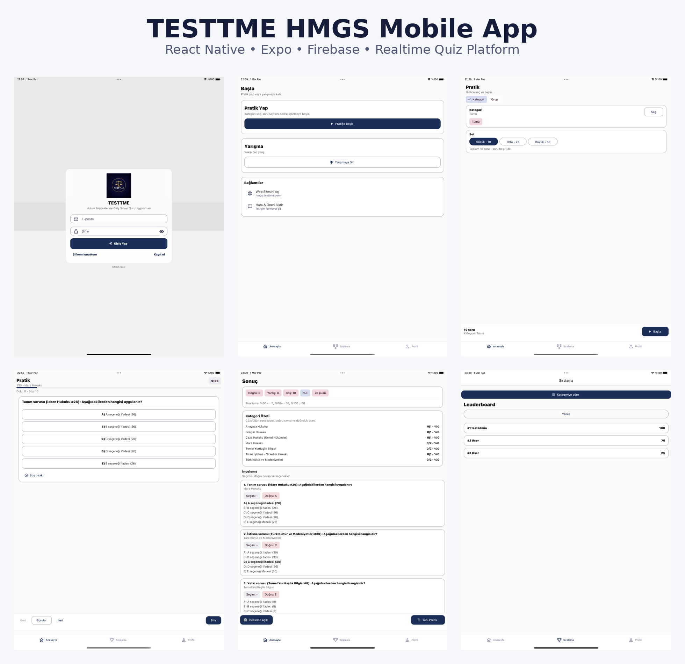
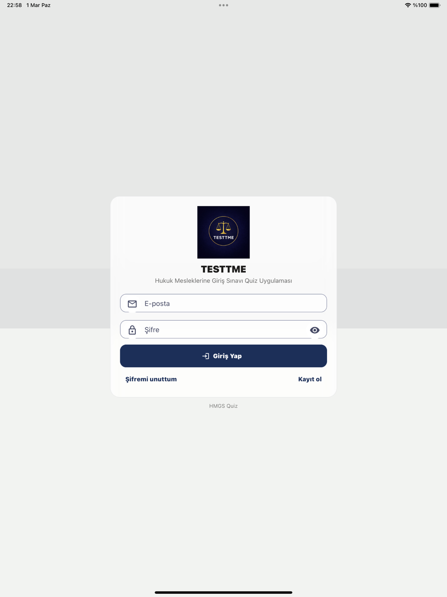
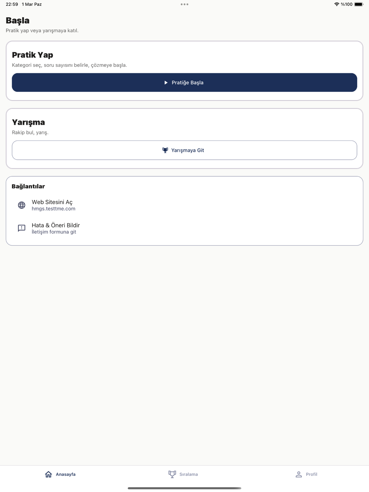
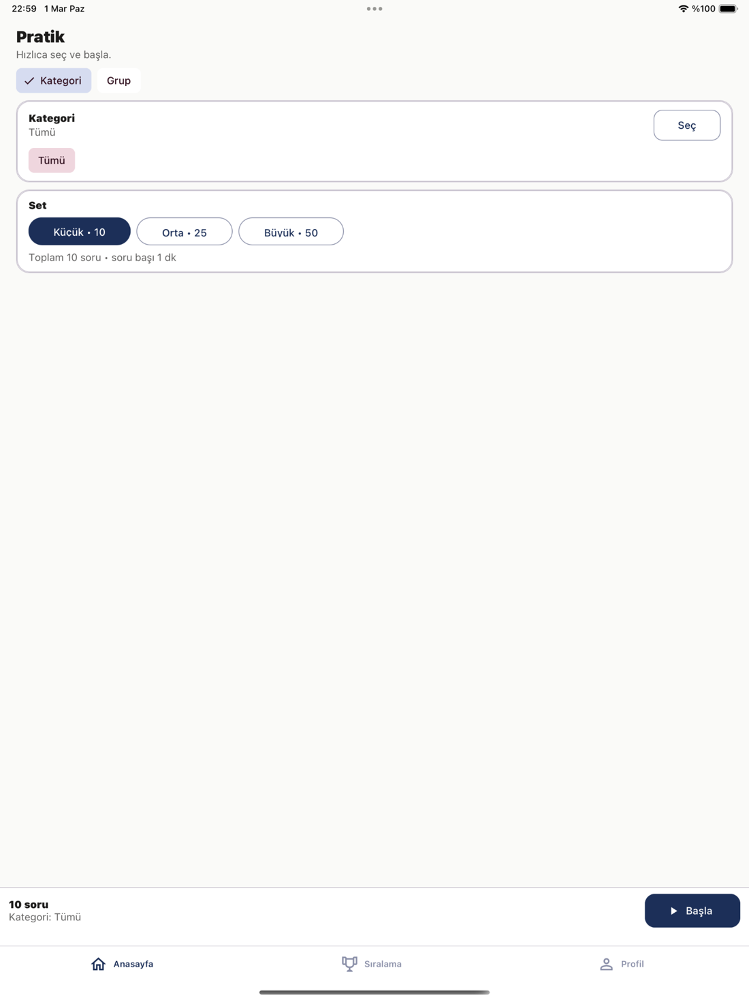
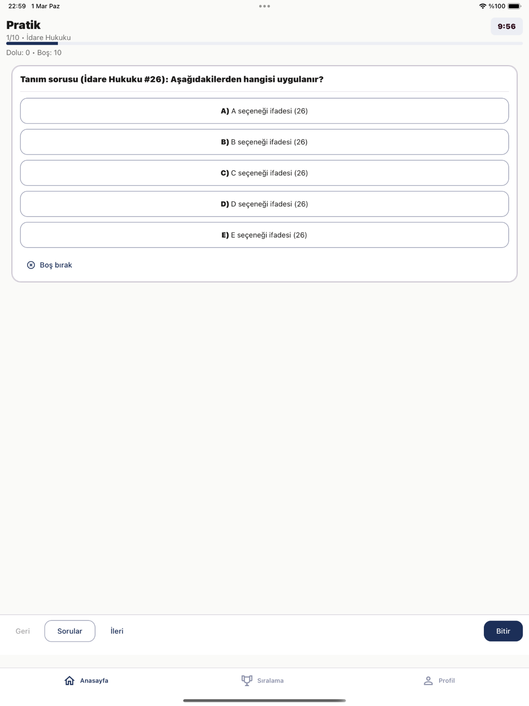
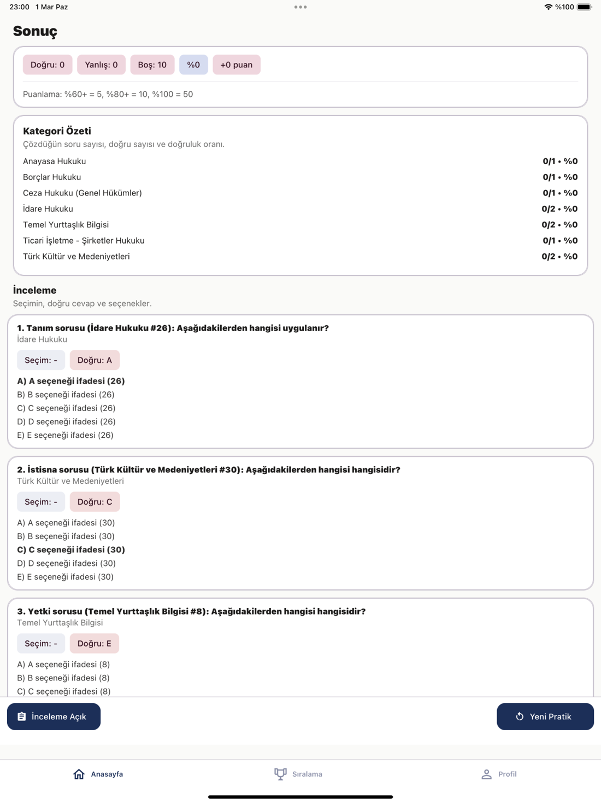
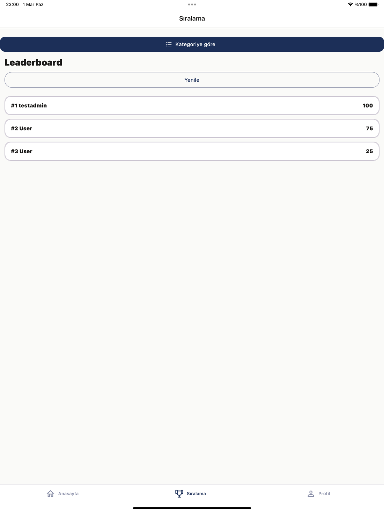

# 📱 TESTTME HMGS Mobile App

**Production-ready cross-platform quiz & realtime contest platform built with React Native, Expo and Firebase.**

---

## 🚀 Overview

HMGS is a high-performance mobile quiz application designed for competitive exam preparation.  
The platform supports both **practice mode** and **realtime competitive contests**, focusing on scalability, responsiveness and clean architecture.

---

## ✨ Key Features

- ⚡ Realtime multiplayer contest system  
- 🧠 Practice & timed exam modes  
- 📊 Category-based leaderboard  
- 🔐 Secure authentication (Firebase Auth)  
- ☁️ Scalable Firestore data model  
- 📱 Cross-platform (iOS & Android)  
- 🎯 Modular and maintainable architecture  

---

## 🏗️ Architecture Highlights

- Feature-based modular structure  
- Realtime event-driven contest flow  
- Optimized Firestore read/write patterns  
- Clean separation of mobile and backend layers  
- Designed for scalability and maintainability  

---

## 🧪 Core User Flows

1. User authentication  
2. Practice session creation  
3. Timed quiz solving  
4. Realtime contest matching  
5. Leaderboard ranking  
6. Result analytics  

---

## 🛠️ Tech Stack

**Mobile**

- React Native (Expo)
- TypeScript
- React Navigation

**Backend & Services**

- Firebase Auth
- Firestore
- Node.js (Express)
- Socket.IO (realtime layer)

---

## 📸 Screens

<table>
  <tr>
    <td align="center">
      <b>Login</b> 
      
    </td>
    <td align="center">
      <b>Home</b> 
      
    </td>
    <td align="center">
      <b>Practice Setup</b> 
      
    </td>
  </tr>
  <tr>
    <td align="center">
      <b>Question</b> 
      
    </td>
    <td align="center">
      <b>Results</b> 
      
    </td>
    <td align="center">
      <b>Leaderboard</b> 
      
    </td>
  </tr>
</table>

---

## 🔒 Source Code Notice

Most production repositories are private due to project and client confidentiality.

I’m happy to provide:

- ✅ Live app walkthrough  
- ✅ Architecture deep dive  
- ✅ Selected code samples (upon request)

---

## 👩‍💻 My Role

- Full-stack development  
- Mobile architecture design  
- Realtime infrastructure  
- Performance optimization  
- Production maintenance  

---

🔒 Source code is private due to project confidentiality.  
I can provide a live walkthrough if required.

